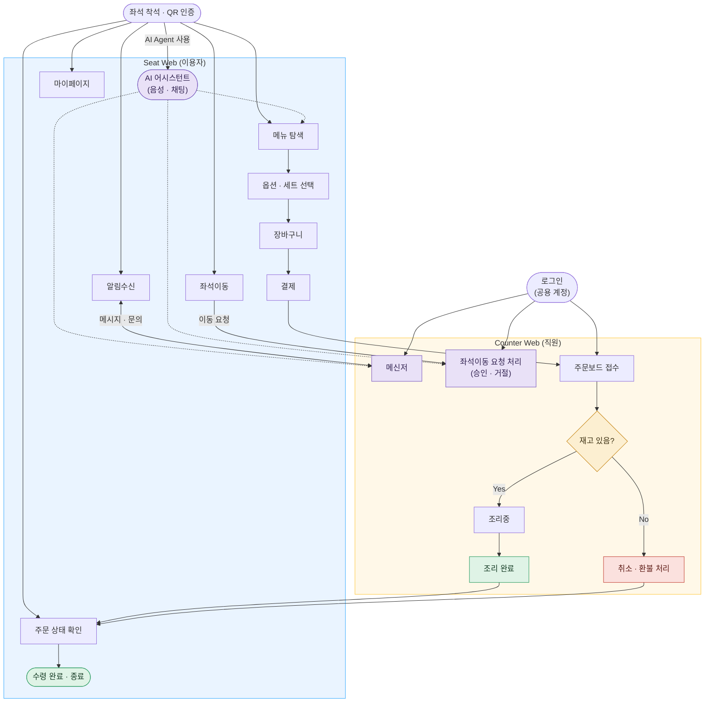
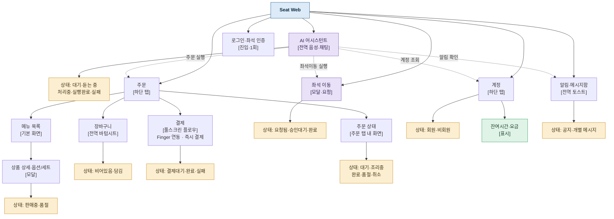
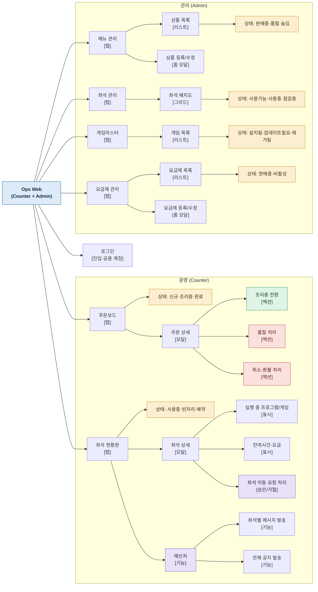

# SHIFT IA 도면

PC방 통합 소프트웨어 SHIFT — Seat Web(이용자)·Counter Web(직원) 정보구조 및 서비스 플로우 참조 문서.
FigJam 실물 보드와 2026-09-06 대조 완료한 최종본.

## 프로젝트 컨텍스트

- **프로젝트**: SHIFT (PC방 통합 소프트웨어, AI 에이전트 기반 주문·결제·좌석이동)
- **담당 트랙**: IA / Wireframe / Design System / UI (오너: 김동욱, W5~W8)
- **시스템 경계**:
  - 결제/인증은 "핑거(Finger)"와 연동 — 자체 결제 인프라를 새로 만들지 않음
  - 노하드(디스크리스) 인프라는 기존 것 유지 — 대체 대상 아님
  - 신규 개발 범위: Seat Shell(Windows) + Seat Web + Ops/Counter Web(운영+관리 통합) 클라이언트, 그 위의 AI 에이전트(음성·채팅) 레이어
- **팀 구조 (SHIFT P1 Master WBS v1.0 기준)**:
  - 김동욱: IA/Wireframe/Design System/UI (W5~W8) — 이 문서의 산출물
  - 김정욱: 경쟁사 분석·System Architecture/ADR·Domain Model/ERD — 아키텍처 총괄
  - 이영광: WBS 마스터·Test Strategy/QA·최종 인도 — PM 겸 QA/배포 총괄
  - 이승화: VOC 추적·Runbook/교육
  - 노은지/박상준: Backend Domain/API/Payment Integration(W5~W15) — Finger 연동
  - 조재민: Seat Shell/Seat Web/Counter·Admin 구현(W6~W10) — 이 IA를 이어받아 개발
- **핸드오프**: 김동욱의 IA/Wireframe(W5~W8)이 끝나야 조재민의 구현(W6~W10)이 이어지는 구조라 일정이 타이트하게 겹침. Handoff 산출물은 QA가 검증 가능한 수준의 상태/인터랙션 스펙 필요.

---

## Sheet 01 — Service Flow (최종본)

Seat Web(이용자)와 Counter Web(직원) 사이의 전체 서비스 흐름. 주문(메뉴탐색→옵션·세트선택→장바구니→결제→주문보드 접수→조리/취소→주문 상태 확인→수령 완료)과 좌석이동·메신저(AI 지름길 + 직접 경로)가 모두 끝까지 연결된 상태.

핵심 설계 결정:
- **AI 어시스턴트의 점선은 메뉴 탐색 하나에만 연결**해 그 뒤로 이어지는 실선 체인(메뉴탐색→옵션·세트선택→장바구니→결제) 전체를 대신 수행함을 나타낸다 — 단계마다 따로 긋지 않는다.
- **좌석이동·메신저는 AI 없이도 항상 쓸 수 있어야 한다**: AI 점선 지름길뿐 아니라, 좌석 착석 지점에서 바로 가는 실선 경로(좌석이동 → 좌석이동 요청 처리, 알림수신 ↔ 메신저)가 별도로 존재한다.
- **주문 상태 확인은 결제 이후 단계가 아니라**, 알림수신·좌석이동·마이페이지와 같은 층위의 직접 진입 가지다 — 언제든 확인 가능한 화면이기 때문.
- **Counter Web도 Seat Web과 대칭**으로 로그인(공용 계정)에서 주문보드·좌석이동 요청 처리·메신저 세 갈래로 갈라진다.
- 결제 → 주문보드 접수로 카운터에 전달되고, 조리 완료·취소·환불 처리가 모두 주문 상태 확인을 거쳐 수령 완료·종료로 합류한다.



---

## Sheet 02 — Seat Web IA

이용자가 좌석에서 접속하는 화면. 하단 탭은 주문·계정 2개로 단순화했고, 주문 상태는 별도 탭이 아니라 주문 탭 안의 한 단계로 포함된다. AI 어시스턴트가 전역에서 주문·좌석이동·알림·계정 조회까지 대신 실행하며(점선), 메뉴 결제는 Finger 연동으로 즉시 처리되고 PC 이용시간·요금(계정 탭)과는 완전히 분리된다.



---

## Sheet 03 — Ops Web IA (Counter + Admin)

카운터 직원과 관리자가 함께 쓰는 공용 계정 화면. 운영(주문·좌석·메신저)과 관리(메뉴·좌석·게임·요금제) 두 영역으로 나뉜다. 메신저는 좌석 상세를 거치지 않는 좌석현황판의 독립 기능이다.



---

## 참고

- 원본 참조 아티팩트: https://claude.ai/code/artifact/ec7f5477-2fd0-41f6-8c69-a7a00f7ed7e4
- GitHub은 코드 블록의 ` ```mermaid ` 펜스를 자동으로 다이어그램 렌더링한다 (README.md에서 바로 확인 가능).
- 다음 단계: 화면 단위 와이어프레임 (로드맵 4~7단계, W5~W8).
